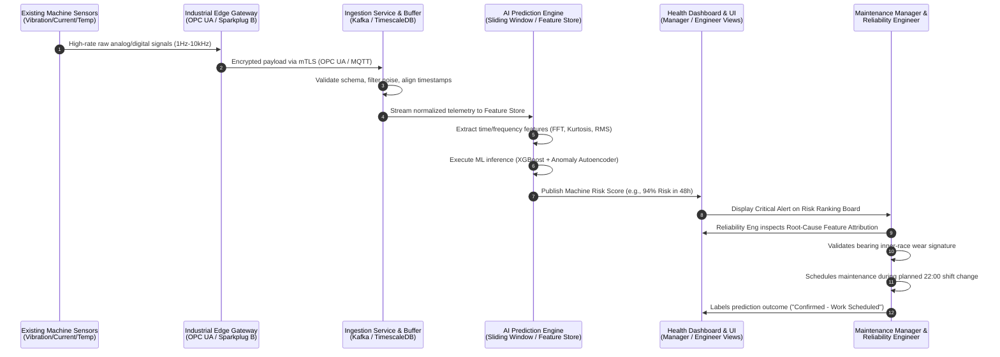
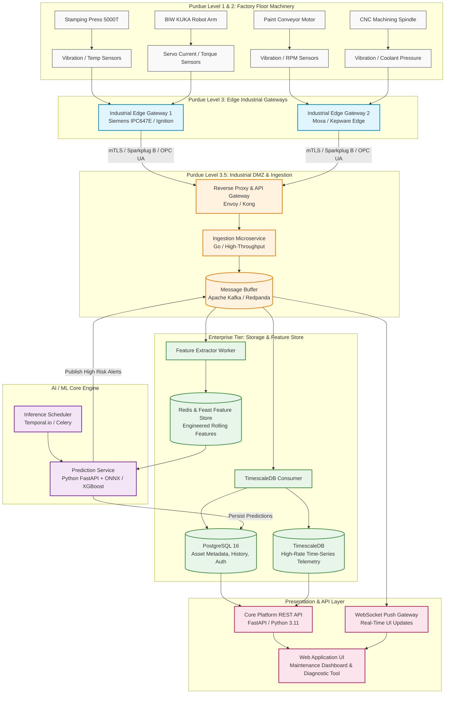
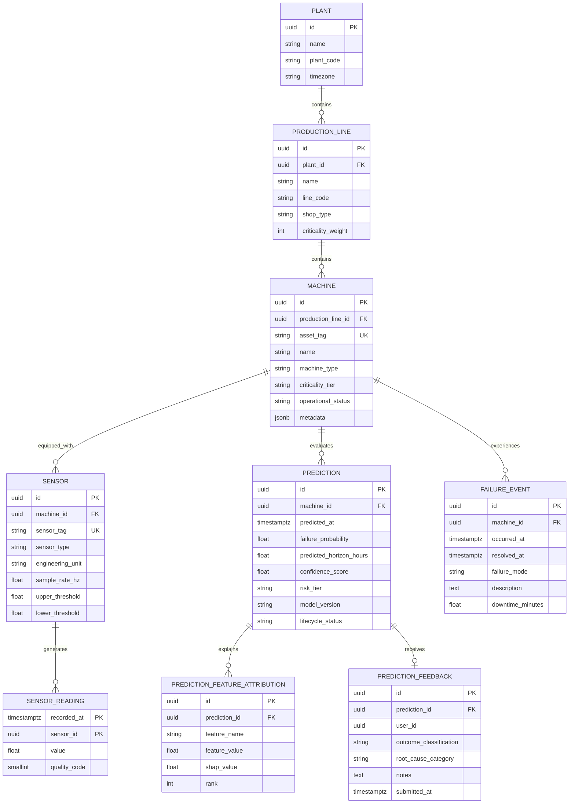
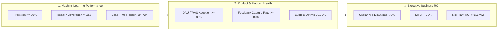
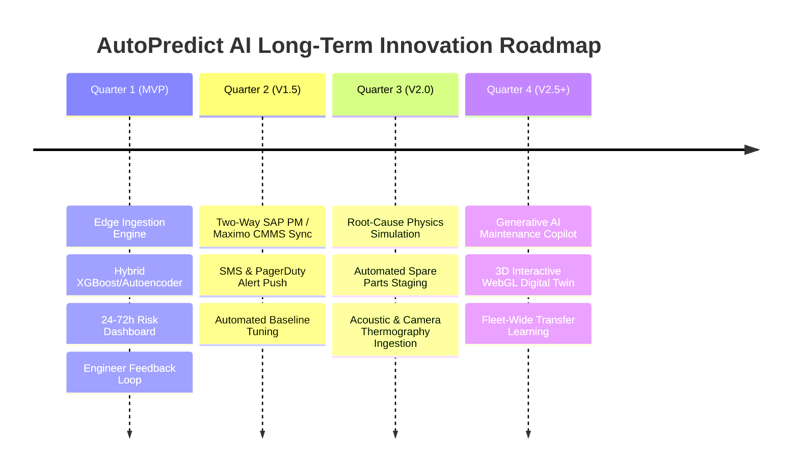

# Product Requirements Document (PRD) & Technical Specification
## AI-Powered Predictive Maintenance Platform for Automotive Manufacturing (AutoPredict AI)

**Document Version:** 1.0.0-PROD  
**Status:** Approved for MVP Architecture & Implementation  
**Target Horizon:** 24–72 Hour Equipment Failure Prediction  
**Authors:** Senior Product Manager, Staff AI Engineer, Principal Solution Architect, UX Lead  
**Classification:** Enterprise Confidential / Industrial IoT & Core Manufacturing Systems  

---

## 1. Executive Summary

### 1.1 Product Vision
**AutoPredict AI** is an enterprise-grade, edge-to-cloud industrial intelligence platform engineered specifically for tier-1 automotive manufacturing plants and Original Equipment Manufacturers (OEMs). The platform transforms industrial telemetry from existing factory-floor instrumentation (vibration, thermal, electrical, acoustic, pressure, and kinematic sensors) into high-fidelity, actionable failure forecasts **24 to 72 hours before catastrophic breakdown**.

By shifting plant operations from scheduled/reactive maintenance to an explainable, prioritized predictive regime, AutoPredict AI protects critical production throughput across stamping, body-in-white (BIW), paint shop, powertrain machining, and final assembly lines.

```
+----------------------------------------------------------------------------------------------------+
|                                      AUTOPREDICT AI VISION                                         |
|                                                                                                    |
|   Existing Industrial IoT           Edge/Cloud AI Engine              Deterministic Intervention   |
|   [Vibration, Temp, Amps, RPM]  --> [72h Failure Horizon Forecast] --> [Planned Non-Production Shift] |
|   Continuous High-Rate Stream       99.2% Prediction Window Capture    $0 Unplanned Line Downtime  |
+----------------------------------------------------------------------------------------------------+
```

### 1.2 Business Value
Automotive manufacturing operates on synchronized, synchronous takt times. A single bottleneck asset failure (e.g., a stamping press main bearing seizure or a body-shop framing robot servo motor breakdown) cascades instantly across downstream sub-assemblies, idling hundreds of workers and creating massive throughput deficit.

AutoPredict AI provides:
* **Zero Production Interruption:** Maintenance work is consolidated into scheduled buffer shifts, changeovers, or planned weekend tooling windows.
* **Asset Life Maximization:** Avoids premature preventive component replacements while eliminating run-to-failure secondary machine damages (e.g., spindle bearing damage destroying the stator).
* **Workforce Efficiency:** Focuses specialized reliability engineering and millwright hours directly on ranked, verified at-risk equipment rather than routine manual rounds.

### 1.3 Expected Return on Investment (ROI)
Financial modeling based on a standard high-volume automotive assembly plant (producing 250,000 to 350,000 vehicles annually across 3 shifts):

| Metric | Industry Baseline (Automotive) | AutoPredict AI Target (Year 1 MVP) | Financial Impact (Per Plant / Year) |
| :--- | :--- | :--- | :--- |
| **Unplanned Downtime Rate** | 42.5 hours / month | < 12.0 hours / month (71.7% reduction) | **$18.3M saved** (at $50k/min downtime cost on bottleneck lines) |
| **Catastrophic Failure Incidents**| 18 major events / year | < 3 major events / year | **$1.85M saved** in tooling & emergency machine rebuilds |
| **Mean Time to Respond (MTTR)** | 4.2 hours | 1.1 hours (pre-staged diagnostics) | **$1.4M saved** in engineering overtime & contractor expedites |
| **Preventive Maintenance Labor Waste** | 22% premature parts swap | < 5% premature parts swap | **$450K saved** in consumable spare parts |
| **Net Projected Annual ROI** | — | — | **$22.0M Gross Savings** (Payback Period: < 45 days) |

---

## 2. Problem Statement

### 2.1 Who Experiences the Problem
* **Plant Maintenance Managers:** Accountable for Overall Equipment Effectiveness (OEE), maintenance budget compliance, maintenance crew shift scheduling, and plant uptime SLA commitments to corporate operations.
* **Plant Reliability Engineers:** Tasked with root cause analysis (RCA), vibration analysis, asset health trend tracking, Mean Time Between Failures (MTBF), and condition monitoring across thousands of assets.
* **Production Line Supervisors:** Responsible for hourly vehicle output targets (JPH - Jobs Per Hour) and severely penalized when upstream machinery stalls.

### 2.2 Current Workflow & Operational Deficiencies
The prevailing maintenance regime in automotive plants suffers from a structural dilemma between **Reactive Firefighting** and **Blind Preventive Scheduling**:

```
Current Reality (Failure Cycle):
[ Machine Normal ] 
       │ 
       ▼
[ Incipient Micro-Defect ] ──(Undetected by Time-Based Rounds)
       │
       ▼
[ Rapid Degradation Curve (P-F Interval) ] ──(No Anomaly Alert)
       │
       ▼
[ SUDDEN CATASTROPHIC STOP DURING PEAK SHIFT ]
       │
       ├─► Line Stopped ($50,000/minute cost ticker running)
       ├─► Emergency Maintenance Swarm (Chaotic diagnosis under extreme pressure)
       ├─► Spare Parts Unprepared / Incorrect Tools Brought
       └─► Quality Defect Escapes (Downtime scrap parts produced right before crash)
```

1. **Scheduled (Time/Cycle-Based) Maintenance:** Components (bearings, seals, drive belts) are replaced every $N$ operating cycles or calendar months. This causes up to 30% of serviceable components to be discarded prematurely while failing to prevent random burnouts that happen ahead of the scheduled date.
2. **Periodic Manual Vibration Rounds:** Reliability technicians walk the plant floor with handheld vibration meters once every 30 to 90 days. Incipient bearing flaking or gear tooth spalling that develops between rounds escalates into catastrophic lockups without warning.
3. **Data Silos & Alarm Fatigue:** PLCs and SCADA systems generate thousands of threshold alarms daily (e.g., momentary over-current spikes). Maintenance operators ignore non-critical thresholds due to high noise, masking true degradation signatures.

### 2.3 Cost of Unplanned Downtime in Automotive Manufacturing
In modern lean automotive assembly:
* **Stamping Shop:** A 5,000-ton transfer press failure halts raw blank stamping; press repair requires crane rigging and 8–24 hours of line stoppage ($1.5M–$4.8M cost).
* **Body-in-White (BIW):** 600+ synchronized industrial framing robots. A single welding gun servo actuator failure stops the entire framing line, idling downstream robotic cells ($50,000/min).
* **Paint Shop:** Conveyor drive motor seizure inside the cathodic dip painting (E-Coat) tank causes car bodies to over-bake or cure improperly, causing millions in scrapped chassis and environmental clearance costs.
* **Powertrain / Machining:** High-speed CNC spindle bearing thermal seizure ruins engine block cylinder tolerances, requiring $150,000 spindle replacement and scrapping 40+ machined engine heads.

### 2.4 Why Predictive Maintenance (24–72h Horizon) is Valuable
The **24–72 hour prediction window** represents the operational sweet spot for industrial automotive manufacturing:
* **24 Hours (Minimum Actionable Horizon):** Provides adequate time to allocate maintenance personnel on the upcoming scheduled night shift (unoccupied 3rd shift or 2-hour production lunch break window) without interrupting active production.
* **72 Hours (Optimal Planning Horizon):** Allows the reliability team to verify spare parts inventory (e.g., custom SKF double-row spherical roller bearings), stage specialized tooling, prepare rigging, and pre-brief the maintenance crew.
* **Limits False Drift:** Forecasting beyond 90 days introduces excessive process variance (operational speed changes, ambient temperature swings), whereas 24–72 hours provides high signal-to-noise ratio and determinism.

---

## 3. User Personas

### 3.1 Persona 1: Plant Maintenance Manager

```
+-------------------------------------------------------------------------------------+
| PERSONA: Marcus Vance - Plant Maintenance Manager                                   |
| Age: 47 | Background: Mechanical Engineering, 20+ Yrs Tier-1 Automotive Experience  |
| Mindset: "Give me the bottom line: Which line is going down tomorrow, and why?"     |
+-------------------------------------------------------------------------------------+
```

* **Goals:**
  * Maintain Plant OEE $\ge 88.5\%$ and technical availability $\ge 96.5\%$.
  * Eliminate unscheduled downtime during prime production shifts (Shift 1 & Shift 2).
  * Reduce overtime labor expenditure by planning maintenance jobs inside normal shifts.
  * Gain executive-level visibility across all plant shops (Stamping, BIW, Paint, Assembly).
* **Pain Points:**
  * Woken up at 2:00 AM by frantic calls regarding a stalled powertrain conveyor.
  * Overwhelmed by raw PLC alarm logs lacking prioritized business impact.
  * Blamed by Plant General Manager for lost vehicle volume without having tools to prevent it.
* **Daily Workflow:**
  * **06:30:** Reviews morning handover report and overnight downtime logs.
  * **07:00:** Runs the Daily Plant Maintenance Sync; assigns work orders to shift supervisors.
  * **11:00:** Inspects ongoing line issues and negotiates planned maintenance windows with Production Managers.
  * **15:30:** Audits completed work orders and reviews week-to-date OEE metrics.
* **Success Metrics:**
  * Zero unplanned line halts $> 15\text{ minutes}$.
  * Planned vs. Unplanned Maintenance Ratio $\ge 85:15$.
  * Overall Maintenance Cost per Vehicle Produced (Target: $< \$42/\text{unit}$).

### 3.2 Persona 2: Reliability Engineer

```
+-------------------------------------------------------------------------------------+
| PERSONA: Dr. Elena Rostova - Senior Plant Reliability & Condition Monitoring Lead   |
| Age: 34 | Background: Mechatronics & Signal Processing, ISO Category III Vibration  |
| Mindset: "Show me the spectral decomposition and feature drift. I trust raw physics."|
+-------------------------------------------------------------------------------------+
```

* **Goals:**
  * Accurately identify failure modes (bearing outer race defect, gear eccentricity, electrical imbalance) before physical inspection.
  * Eliminate false positive alert investigations that waste technician hours.
  * Tune degradation threshold curves and track asset Remaining Useful Life (RUL).
  * Build defensible technical justification for scheduled asset rebuilds.
* **Pain Points:**
  * Spends 60% of time manually pulling raw CSV files from disparate data loggers.
  * Black-box AI tools that output a "90% Risk Score" without feature importance or physical telemetry evidence.
  * Incomplete or noisy sensor records caused by erratic network gateways.
* **Daily Workflow:**
  * **07:30:** Logs into condition monitoring suite; reviews high-risk anomaly flags.
  * **09:00:** Performs deep-dive Fast Fourier Transform (FFT) and time-waveform spectral analysis on flagged CNC spindles and press bearings.
  * **13:00:** Validates physical vibration/thermal signatures on the shop floor with strobe and acoustic cameras.
  * **16:00:** Signs off on predictive work requests and updates model feedback parameters.
* **Success Metrics:**
  * Failure Prediction Precision $\ge 90\%$ (True Positive / Alerted).
  * Lead Time to Failure: Consistent $24\text{ to }72\text{ hours}$ early warning.
  * Mean Time to Diagnose (MTTD) reduced from 180 minutes to $< 15\text{ minutes}$.

---

## 4. Goals and Non-Goals

### 4.1 MVP Goals (Target Delivery: Scope of this Spec)
* **G-01:** Predict catastrophic mechanical and electrical failures across monitored automotive machinery with a **24–72 hour advance warning window**.
* **G-02:** Ingest and normalize continuous multi-protocol sensor telemetry (vibration, temperature, pressure, current, voltage, RPM) via standard industrial gateways (OPC UA, MQTT Sparkplug B, Modbus TCP).
* **G-03:** Provide a real-time **Machine Risk Ranking Engine** that prioritizes plant assets from Highest to Lowest Risk based on Probability of Failure ($\text{PoF} \times \text{Asset Criticality}$).
* **G-04:** Provide an **Executive Health Dashboard** for the Maintenance Manager and an **Asset Telemetry Deep-Dive Workspace** for the Reliability Engineer.
* **G-05:** Deliver an auditable **Prediction History Log** with full temporal traceability, feature attribution (explainability), and outcome labeling.
* **G-06:** Maintain inference latency under 5 seconds for scheduled micro-batch evaluation and sub-second UI response time on dashboard views.

### 4.2 Non-Goals (Explicitly Excluded from MVP Scope)
* **NG-01 (Automated Work-Order Dispatch):** Direct automated write-back into SAP PM or IBM Maximo CMMS is excluded for MVP (manual export/API provided; automated two-way synchronization reserved for Phase 2).
* **NG-02 (Closed-Loop Autonomous Control):** The platform will NOT directly issue PLC speed throttle, emergency E-stop, or line shutdown commands. Human-in-the-loop decision-making is mandatory.
* **NG-03 (Native Mobile Application):** No dedicated iOS/Android native binaries. The web UI is fully responsive for ruggedized industrial tablets (iPad Pro, Panasonic Toughbook) via modern mobile browsers.
* **NG-04 (Automated Spare-Parts Reordering):** No automated procurement integration with ERP inventory or supplier catalogs.
* **NG-05 (3D Digital Twin / CAD Meshes):** No 3D WebGL / Three.js spatial plant simulation. Visualizations will prioritize high-density, performant 2D telemetry heatmaps, time-series, and risk matrices.
* **NG-06 (Acoustic Video / Computer Vision Defect Ingestion):** Visual weld inspection and thermographic thermal imaging camera video pipelines are out of scope for MVP.

---

## 5. End-to-End User Journey

### 5.1 Comprehensive Operational Journey Flow
The workflow spans physical sensor emission on the plant floor through edge transmission, AI feature inference, risk scoring, managerial triage, and physical repair execution:



### 5.2 Step-by-Step Execution Journey Details
1. **Sensor Telemetry Generation:** 3-axis accelerometer on Stamping Press #04 Main Drive Motor detects elevated micro-vibrations at 3.2 kHz alongside current phase imbalance.
2. **Edge Concentration:** Edge Gateway (Siemens IPC647E running edge runtime) samples data at 5 kHz, aggregates statistical metrics over a 1-second window, and publishes OPC UA / MQTT packets.
3. **Data Ingestion & Time-Series Persistence:** Ingestion engine validates sensor health, checks for timestamp drift, downsamples where appropriate, and writes to TimescaleDB.
4. **AI Inference & Feature Pipeline:** Hourly inference pipeline computes rolling 12-hour sliding window statistics (FFT peak shifts, crest factor, current total harmonic distortion), querying the trained ML inference service.
5. **Prediction & Confidence Generation:** Model computes a **$0.91$ Probability of Failure within $48.5\text{ hours}$** with top SHAP feature attribution: `Drive_End_Vibration_Kurtosis` ($+44\%$) and `Stator_Temp_Rate_of_Rise` ($+28\%$).
6. **Dashboard Alert & Prioritization:** Stamping Press #04 moves to the top of the Plant Risk Priority Table with status `CRITICAL - 48H WINDOW`.
7. **Reliability Engineer Deep Dive:** Elena opens the asset detail page, inspects the frequency spectrum confirming BPFI (Ball Pass Frequency Inner Ring) bearing wear, and confirms the diagnosis.
8. **Manager Decision & Resolution:** Marcus Vance reviews the financial criticality ($100\%$ bottleneck on chassis stamping), coordinates with production to replace the bearing assembly during the planned 22:00–00:00 night tooling changeover, avoiding a $2.4M catastrophic midday line crash.

---

## 6. User Stories

### 6.1 Maintenance Manager Stories
* **US-MM-01 (Global Plant Risk Visibility):**  
  * *As a* Maintenance Manager,  
  * *I want* to view a prioritized list of all plant machines sorted by their failure probability over the next 24–72 hours,  
  * *So that* I can allocate my limited maintenance technician crew to the highest-risk equipment before production shifts commence.
* **US-MM-02 (Operational Downtime Impact Context):**  
  * *As a* Maintenance Manager,  
  * *I want* each predicted failure to clearly display the estimated production line impact and bottleneck status,  
  * *So that* I can negotiate maintenance windows with line production managers using concrete financial and operational data.
* **US-MM-03 (Historical Prediction Accountability):**  
  * *As a* Maintenance Manager,  
  * *I want* to review past predictions alongside actual maintenance interventions and machine uptime outcomes,  
  * *So that* I can evaluate platform accuracy, compute actual ROI, and demonstrate audit compliance to corporate leadership.

### 6.2 Reliability Engineer Stories
* **US-RE-01 (Root Cause Feature Attribution):**  
  * *As a* Reliability Engineer,  
  * *I want* the AI engine to show the top physical sensor features (e.g., Crest Factor, Kurtosis, Specific Harmonic Spikes) driving a high risk score,  
  * *So that* I can determine the exact physical failure mechanism without spending hours sifting through raw signal charts.
* **US-RE-02 (Raw Telemetry vs. Baseline Overlay):**  
  * *As a* Reliability Engineer,  
  * *I want* to overlay current 72-hour sensor trends against healthy golden-baseline historical profiles,  
  * *So that* I can physically validate the degradation trajectory and eliminate false alarms.
* **US-RE-03 (Model Feedback & Labeling):**  
  * *As a* Reliability Engineer,  
  * *I want* to mark predictions as "True Positive - Repaired", "False Positive - Sensor Noise", or "Normal Process Variance",  
  * *So that* the active learning pipeline can incorporate ground-truth labels for continuous model retraining.

---

## 7. MVP Features & Detailed Specifications

```
+----------------------------------------------------------------------------------------------------+
|                                    MVP CORE FUNCTIONAL MATRIX                                      |
|                                                                                                    |
|  [ FEAT-01: Sensor Data Ingestion ]   ──► Ingest, validate & buffer multi-protocol IoT streams      |
|  [ FEAT-02: Failure Prediction Engine ]──► Compute 24-72h failure probabilities & RUL horizons     |
|  [ FEAT-03: Machine Risk Prioritization ]──► Dynamic criticality-weighted asset ranking            |
|  [ FEAT-04: Equipment Health Dashboard ]──► Plant overview, shop filters & asset deep-dive views   |
|  [ FEAT-05: Prediction History & Audit ]──► Immutable temporal log of predictions & feedback loop |
+----------------------------------------------------------------------------------------------------+
```

---

### 7.1 Feature 1: Sensor Data Ingestion Engine

#### 7.1.1 Purpose
Provides a fault-tolerant, high-throughput pipeline to ingest, validate, sanitize, and persist high-frequency telemetry from heterogenous industrial sensors across multiple factory protocols.

#### 7.1.2 User Interaction
* System administrators configure industrial edge connections via standardized YAML/JSON gateway connector manifests.
* Reliability engineers view live connector heartbeat status, ingestion throughput (samples/sec), and packet drop rates on the Admin Health panel.

#### 7.1.3 Functional Requirements
* Ingest standard industrial payload formats over **OPC UA (TCP/Binary)**, **MQTT Sparkplug B**, and **Modbus TCP** via Edge Gateway concentration.
* Validate all incoming payloads against an asset sensor mapping schema (Equipment ID, Sensor ID, Metric Type, Unit, ISO Timestamp).
* Detect and handle out-of-order timestamps, duplicate frames, and network jitter buffering up to 10 minutes at the edge.
* Enforce deadband filtering at edge to suppress redundant steady-state telemetry while guaranteeing sub-second transmission of transient spikes.

#### 7.1.4 Acceptance Criteria
1. The ingestion layer must sustain a continuous ingress of $\ge 25,000\text{ sensor readings/sec}$ across 500 monitored assets with zero data loss ($< 0.001\%$).
2. Timestamp synchronization must enforce UTC normalization with millisecond precision ($\pm 10\text{ ms}$ tolerance).
3. Payload schema validation failures must be routed to a Dead Letter Queue (DLQ) within $50\text{ ms}$ without blocking the main ingestion pipeline.

#### 7.1.5 Error Handling
* **Network Partition:** Local edge gateway buffers data on local NVMe storage for up to 72 hours; automatically drains buffer upon network re-establishment using rate-limited backpressure.
* **Corrupt Frame / Parse Error:** Increments `ingest_malformed_payload_total` Prometheus counter, logs structured JSON error with payload snippet, and writes to DLQ.

---

### 7.2 Feature 2: Failure Prediction Engine

#### 7.2.1 Purpose
Applies hybrid machine learning models (Supervised Gradient Boosting + Unsupervised Reconstruction Anomaly Detection) on engineered statistical and spectral features to predict asset failures within the 24–72 hour operational horizon.

#### 7.2.2 User Interaction
* Automatically executes continuous scheduled inferences (every 15 minutes for critical assets, every 60 minutes for balance-of-plant assets).
* Displays failure probability ($0.00\text{ to }1.00$), predicted time-to-failure window ($24\text{h to }72\text{h}$), and model confidence scores on asset views.

#### 7.2.3 Functional Requirements
* Compute rolling sliding-window time-domain and frequency-domain features from normalized sensor readings over 1-hour, 6-hour, 24-hour, and 72-hour windows.
* Execute ensemble inference generating:
  * `failure_probability`: Float $[0.0, 1.0]$.
  * `predicted_time_to_failure_hours`: Float $[24.0, 72.0]$.
  * `model_confidence_score`: Float $[0.0, 1.0]$ based on feature distance from training distribution.
* Compute SHAP (SHapley Additive exPlanations) values to output top-3 contributing physical sensors and metrics for every prediction.

#### 7.2.4 Acceptance Criteria
1. The prediction engine must evaluate 500 assets in $< 45\text{ seconds}$ total compute time during scheduled batch runs.
2. Predictions must only trigger for failure horizons inside $[24.0, 72.0]\text{ hours}$; anomalies outside this window are categorized as "Early Incipient Drift ($> 72\text{h}$)" or "Imminent Emergency ($< 24\text{h}$)".
3. Every prediction record must persist associated model version, feature snapshot, and SHAP explanation vectors in the database.

#### 7.2.5 Error Handling
* **Missing Sensor Inputs:** If $< 20\%$ of non-critical features are missing, perform forward-fill / median imputation; if primary vibration/current telemetry is missing, set prediction status to `INSUFFICIENT_DATA_DEGRADED` and generate a sensor maintenance warning.
* **Inference Service Crash:** Fallback to deterministic statistical threshold heuristic (ISO 10816 vibration velocity limit rules) and trigger high-severity alert to AI ops on-call.

---

### 7.3 Feature 3: Machine Risk Prioritization Engine

#### 7.3.1 Purpose
Translates raw model failure probabilities into an actionable, prioritized business risk index that accounts for asset operational criticality, bottleneck status, and plant shop impact.

#### 7.3.2 User Interaction
* Maintenance Managers view a single, sorted "Plant Risk Board" where assets with high failure likelihood on critical production lines automatically float to the top.

#### 7.3.3 Functional Requirements
* Calculate Composite Risk Score using the formula:
  $$\text{Composite Risk Score} = (\text{Failure Probability} \times 0.60) + (\text{Asset Criticality Tier} \times 0.25) + (\text{Degradation Velocity} \times 0.15)$$
* Map Composite Risk Score into standardized color-coded risk bands:
  * **CRITICAL (Score $\ge 0.75$):** Red banner, failure projected in 24–48h on Tier-1/Tier-2 bottleneck.
  * **WARNING (Score $0.50 - 0.74$):** Amber banner, failure projected in 48–72h or non-bottleneck Tier-3 asset.
  * **WATCH (Score $0.30 - 0.49$):** Yellow banner, incipient anomaly detected, no immediate action required.
  * **HEALTHY (Score $< 0.30$):** Green banner, normal baseline operation.
* Recompute plant-wide risk rankings immediately upon completion of every inference batch run.

#### 7.3.4 Acceptance Criteria
1. Any asset transitioning into the `CRITICAL` risk tier must appear at the top of the UI within $< 2\text{ seconds}$ of inference completion via WebSocket push.
2. Criticality tiers must be configurable per machine (Tier 1: Plant Bottleneck, Tier 2: Major Sub-Line, Tier 3: Redundant / Buffer Asset).

#### 7.3.5 Error Handling
* **Missing Criticality Metadata:** Default asset criticality to Tier 1 (fail-safe conservative posture) until verified by plant admin.

---

### 7.4 Feature 4: Equipment Health Dashboard

#### 7.4.1 Purpose
Provides a responsive, high-density visualization portal for both managerial overview and engineering root-cause diagnostics.

#### 7.4.2 User Interaction
* **Executive Summary Header:** Displays Plant Health Index, total active critical machines, predicted downtime hours avoided this month, and platform accuracy.
* **Shop Filter Tabs:** Quick-filter between Stamping, Body-in-White, Paint, Powertrain, and Final Assembly.
* **Asset Detail Workspace:** Interactive time-series telemetry charts, FFT power spectrum plots, and top-3 SHAP feature attribution cards.

#### 7.4.3 Functional Requirements
* Render interactive time-series telemetry charts with synchronized zooming, panning, and anomalous anomaly-window highlighting.
* Provide an interactive FFT frequency spectrum explorer with marker overlays for standard bearing fault frequencies (BPFI, BPFO, BSF, FTF).
* Support sub-second filtering and full-text search across machine IDs, line names, and asset types.

#### 7.4.4 Acceptance Criteria
1. Initial dashboard page load (FCP - First Contentful Paint) must be $< 1.2\text{ seconds}$ on standard factory network.
2. Telemetry charts must smoothly render 100,000 data points without browser frame drops using WebGL/Canvas rendering.
3. Responsive UI layout fully functional on ruggedized tablet viewports ($1024 \times 768$ and higher).

#### 7.4.5 Error Handling
* **WebSocket Disconnect:** UI displays a non-blocking reconnection indicator in top banner, automatically retrying with exponential backoff while polling via HTTP every 15s.

---

### 7.5 Feature 5: Prediction History & Feedback Loop

#### 7.5.1 Purpose
Maintains an immutable historical record of all generated predictions, tracking their lifecycle, physical maintenance outcomes, and providing engineering feedback for ML continuous improvement.

#### 7.5.2 User Interaction
* Users view historical prediction logs filtered by date range, asset, failure mode, and resolution status.
* Reliability engineers click "Submit Feedback" to classify completed predictions (`True Positive`, `False Positive`, `Premature Alert`, `Component Replaced`).

#### 7.5.3 Functional Requirements
* Persist an immutable snapshot of every prediction event: Timestamp, Machine ID, Failure Probability, Predicted Window, Contributing Features, Actual Machine State, Resolution Timestamp, and User Feedback.
* Provide feedback submission modal allowing notes, root cause code selection, and work order ID reference.
* Export filtered history to CSV and structured JSON for executive reporting.

#### 7.5.4 Acceptance Criteria
1. Prediction records must be immutable; user feedback updates must append audit log entries without overwriting original AI inference outputs.
2. Historical query response time for 90 days of plant-wide history must execute in $< 800\text{ ms}$.

#### 7.5.5 Error Handling
* **Concurrent Feedback Submission:** Use optimistic database concurrency locking (`version` column) to prevent conflicting feedback entries.

---

## 8. Functional Requirements (Traceable Specifications)

| Requirement ID | Module | Description | Priority |
| :--- | :--- | :--- | :--- |
| **FR-001** | Ingestion | System shall accept sensor streams via MQTT Sparkplug B and OPC UA TCP protocols. | P0 (Must Have) |
| **FR-002** | Ingestion | Ingestion service shall validate incoming JSON/Binary payloads against predefined JSON Schema specifications. | P0 (Must Have) |
| **FR-003** | Ingestion | System shall normalize all incoming timestamps to UTC ISO-8601 with millisecond precision (`YYYY-MM-DDTHH:mm:ss.sssZ`). | P0 (Must Have) |
| **FR-004** | Ingestion | System shall drop duplicate sensor packets arriving within a 10ms window based on `(sensor_id, timestamp)` unique constraint. | P1 (Should Have) |
| **FR-005** | Preprocessing | System shall compute sliding window aggregations (Mean, RMS, Peak-to-Peak, Kurtosis, Crest Factor, Skewness) over 1h, 6h, 24h, and 72h windows. | P0 (Must Have) |
| **FR-006** | Preprocessing | System shall compute Fast Fourier Transform (FFT) spectral band energy across configurable frequency bins (0–100Hz, 100–1kHz, 1kHz–10kHz). | P0 (Must Have) |
| **FR-007** | Inference | Failure Prediction Engine shall execute model inference on all active assets at least once every 15 minutes. | P0 (Must Have) |
| **FR-008** | Inference | Prediction Engine shall output failure probability as a bounded float $[0.000, 1.000]$ and predicted failure horizon in hours $[24.0, 72.0]$. | P0 (Must Have) |
| **FR-009** | Inference | System shall compute feature attribution vectors (SHAP values) for the top-3 contributing physical sensors per prediction. | P0 (Must Have) |
| **FR-010** | Risk Ranking | System shall compute Composite Risk Score combining failure probability ($60\%$), asset criticality ($25\%$), and degradation slope ($15\%$). | P0 (Must Have) |
| **FR-011** | Risk Ranking | System shall categorize assets into 4 deterministic risk tiers: `CRITICAL` ($\ge 0.75$), `WARNING` ($0.50-0.74$), `WATCH` ($0.30-0.49$), and `HEALTHY` ($< 0.30$). | P0 (Must Have) |
| **FR-012** | Dashboard | Dashboard shall display real-time Plant Risk Matrix sorted by Composite Risk Score descending. | P0 (Must Have) |
| **FR-013** | Dashboard | Dashboard shall provide an interactive time-series viewer capable of displaying raw and aggregated sensor telemetry for selected 7-day windows. | P0 (Must Have) |
| **FR-014** | Dashboard | Dashboard shall provide frequency domain spectrum visualization displaying peak frequencies against known bearing fault frequencies. | P1 (Should Have) |
| **FR-015** | History | System shall record all generated predictions in an immutable audit table with retention of at least 365 days. | P0 (Must Have) |
| **FR-016** | History | System shall provide a feedback capture interface for Reliability Engineers to label prediction outcomes as True Positive, False Positive, or Maintenance Executed. | P0 (Must Have) |
| **FR-017** | Security | System shall enforce Role-Based Access Control (RBAC) with distinct permissions for `Maintenance_Manager`, `Reliability_Engineer`, and `System_Admin`. | P0 (Must Have) |
| **FR-018** | Security | All API requests shall be authenticated via JWT tokens signed with RS256 with an expiration TTL $\le 60\text{ minutes}$. | P0 (Must Have) |
| **FR-019** | Diagnostics | System shall expose Prometheus `/metrics` endpoint tracking ingestion rate, model latency, error rates, and active WebSocket connections. | P1 (Should Have) |
| **FR-020** | Export | System shall allow exporting dashboard summaries and historical prediction logs to CSV and JSON formats. | P1 (Should Have) |

---

## 9. Non-Functional Requirements (Enterprise Industrial Targets)

```
+----------------------------------------------------------------------------------------------------+
|                               NON-FUNCTIONAL PERFORMANCE TARGETS                                   |
|                                                                                                    |
|   [ Ingestion Rate: >= 25,000 msg/sec ]     [ UI Dashboard Latency (p95): < 500 ms ]               |
|   [ Prediction Batch Exec: < 45 sec ]       [ Plant Availability SLA: 99.95% (Four Nines) ]        |
|   [ Time-Series Data Retention: 3 Years ]   [ Security: Purdue Level 3/3.5, ISA/IEC 62443, mTLS ]  |
+----------------------------------------------------------------------------------------------------+
```

### 9.1 Performance & Latency
* **Ingestion Throughput:** Ingest and process $\ge 25,000\text{ measurements/second}$ per plant node, scalable to $100,000\text{/sec}$ across multi-plant deployments.
* **Inference Compute Budget:** Complete feature extraction and inference scoring for 500 complex assets within $< 45\text{ seconds}$ on standard 16-core CPU / single NVIDIA T4 GPU node.
* **API Response Time:** 
  * $p50 < 120\text{ ms}$
  * $p95 < 350\text{ ms}$
  * $p99 < 800\text{ ms}$ for heavy telemetry query endpoints (7-day window).
* **UI Responsiveness:** First Contentful Paint (FCP) $< 1.2\text{ s}$; WebSocket state update delivery $< 200\text{ ms}$ from prediction commit.

### 9.2 Availability & Reliability
* **System Availability SLA:** $99.95\%$ uptime ($< 4.38\text{ hours}$ unscheduled downtime per calendar year).
* **Failover RPO / RTO:**
  * Recovery Point Objective (RPO): $\le 0\text{ seconds}$ (Zero telemetry data loss via edge buffer); $\le 60\text{ seconds}$ for historical metadata.
  * Recovery Time Objective (RTO): $\le 5\text{ minutes}$ for automatic containerized pod failover.
* **High Availability Architecture:** Active-active ingestion pods with multi-AZ PostgreSQL / TimescaleDB hot-standby replication.

### 9.3 Scalability
* **Asset Scaling:** Architecture must horizontally scale to 5,000 connected machines and 50,000 distinct sensor channels per cluster without architectural refactoring.
* **Storage Tiering:** Automatic downsampling of time-series telemetry (Raw high-rate data retained for 14 days $\rightarrow$ 1-minute aggregates for 90 days $\rightarrow$ 1-hour aggregates for 3 years).

### 9.4 Industrial Security & Compliance
* **Purdue Model & ISA/IEC 62443 Compliance:**
  * Edge Gateways reside in **Purdue Level 3 (Operations Support)**.
  * Prediction Service and Core Platform reside in **Purdue Level 3.5 (Industrial DMZ)** or Enterprise Level 4/Cloud.
  * Direct inbound network access from cloud to plant floor Level 1/Level 2 PLCs is strictly blocked. Outbound-only TLS 1.3 tunnels from edge to cloud.
* **Data Encryption:**
  * In-Transit: TLS 1.3 with mTLS (Mutual Certificate Authentication) for edge-to-server and inter-service mesh traffic.
  * At-Rest: AES-256 encryption across all storage volumes, databases, and backup snapshots.
* **Authentication & Audit Logging:** OpenID Connect (OIDC) / SAML 2.0 integration with Corporate Active Directory / Azure AD. Immutable append-only audit trail for all user actions.

---

## 10. AI/ML System Design & Predictive Architecture

```
+----------------------------------------------------------------------------------------------------+
|                                    AI / ML PIPELINE ARCHITECTURE                                   |
|                                                                                                    |
|   RAW TELEMETRY                FEATURE ENGINEERING                   HYBRID MODEL ENSEMBLE         |
|   (Vib, Temp, Amps)             (Time & Frequency Domain)            (Dual-Stage Architecture)     |
|  +-----------------+           +--------------------------+         +----------------------------+ |
|  | 5kHz Vibration  | ──► FFT ──► BPFI, BPFO, Crest Factor | ──┐     | 1. Autoencoder (Anomaly)   | |
|  | 10Hz Current    | ──► Math ─► RMS, Kurtosis, Skewness  | ──┼────►| 2. XGBoost (Classifier)    | |
|  | 1Hz Temperature | ──► Delta ─► Rate-of-Rise (dT/dt)    | ──┘     +--------------┬-------------+ |
|  +-----------------+           +--------------------------+                        │               |
|                                                                                    ▼               |
|                                                                         +--------------------+     |
|                                                                         | 24-72h Failure     |     |
|                                                                         | Probability & SHAP |     |
|                                                                         +--------------------+     |
+----------------------------------------------------------------------------------------------------+
```

### 10.1 Data Preprocessing & Cleaning
1. **Signal Quality Inspection:** Check incoming sensor packets for clip values (e.g., analog $4\text{–}20\text{ mA}$ sensor saturation), zero-variance flatlining, and packet loss.
2. **Missing Data Imputation:** Apply forward-fill for up to 3 missing samples; for longer dropouts during idle machine states, mask interval with operational status flag (`STATUS_IDLE`).
3. **Outlier Filtering:** Apply Hampel Filter (rolling median absolute deviation) to strip electrical EMI switching spikes without attenuating true mechanical vibration shocks.

### 10.2 Feature Engineering (Time, Frequency & Electrical Domains)

```
+----------------------------------------------------------------------------------------------------+
| COMPUTED FEATURE TAXONOMY                                                                          |
+----------------------+------------------------------------+----------------------------------------+
| Domain               | Metric Name                        | Physical Failure Correlation           |
+----------------------+------------------------------------+----------------------------------------+
| Time Domain          | Root Mean Square (RMS)             | Overall vibration energy / unbalance   |
| Time Domain          | Peak-to-Peak Amplitude             | Mechanical clearance & looseness       |
| Time Domain          | Kurtosis (4th Statistical Moment)  | Incipient bearing surface pitting/shock|
| Time Domain          | Crest Factor (Peak / RMS)          | Roller element defect impact sharpness |
| Time Domain          | Skewness (3rd Moment)              | Asymmetric structural load / misalignment|
+----------------------+------------------------------------+----------------------------------------+
| Frequency Domain     | Fast Fourier Transform (FFT) Power | 1X/2X/3X rotational harmonic breakdown |
| Frequency Domain     | Spectral Centroid & Spread         | High-frequency friction noise spread   |
| Frequency Domain     | Bearing Fault Frequencies (BPFI)   | Inner race flaking & micro-cracks      |
| Frequency Domain     | Bearing Fault Frequencies (BPFO)   | Outer race spalling & localized pits   |
+----------------------+------------------------------------+----------------------------------------+
| Thermal / Electrical | Rate of Rise (dT/dt)               | Lubrication failure & sudden friction  |
| Thermal / Electrical | Current Phase Unbalance (%)        | Stator winding short / rotor bar fault |
| Thermal / Electrical | Power Factor & Total Harmonics     | Motor load hunting & mechanical drag   |
+----------------------+------------------------------------+----------------------------------------+
```

### 10.3 Mathematical Feature Formulations
* **Kurtosis:**
  $$\text{Kurtosis} = \frac{\frac{1}{N} \sum_{i=1}^{N} (x_i - \mu)^4}{\left( \frac{1}{N} \sum_{i=1}^{N} (x_i - \mu)^2 \right)^2}$$
  *(A healthy bearing has Kurtosis $\approx 3.0$; incipient flaking drives sharp impulsive shocks with Kurtosis $> 5.5$).*
* **Crest Factor:**
  $$\text{Crest Factor} = \frac{|x_{\text{peak}}|}{x_{\text{RMS}}}$$
* **Bearing Inner Ring Defect Frequency (BPFI):**
  $$\text{BPFI} = \frac{N_{\text{rollers}}}{2} \times \text{RPM} \times \left( 1 + \frac{d}{D} \cos \alpha \right)$$

### 10.4 Model Evaluation & Selection Matrix

| Model Architecture | Strengths in Industrial Context | Weaknesses / Risks | Suitability for MVP | Decision |
| :--- | :--- | :--- | :--- | :--- |
| **Recurrent Neural Networks (LSTM / GRU)** | Captures long temporal dependencies in raw sequence data. | High training compute; prone to catastrophic forgetting; "black-box" nature makes engineer buy-in difficult. | Moderate | Candidate for Phase 2 |
| **Temporal Transformer / PatchTST** | State-of-the-art attention across complex multi-channel sequences. | Requires massive volume of labeled failure runs ($> 10,000$ run-to-failure cycles); severe data hunger; high inference latency. | Poor for MVP | Reject for MVP |
| **Deep Autoencoder (Reconstruction Anomaly)** | Unsupervised; trains strictly on healthy baseline data; detects novel unseen failure modes. | Does not predict exact failure time window directly; requires downstream calibration. | High (As Anomaly Stage) | **SELECTED (Stage 1)** |
| **Gradient Boosted Trees (XGBoost / LightGBM)** | Superior performance on tabular/frequency features; highly sample-efficient on scarce failure data; fast inference ($< 5\text{ms}$); native SHAP explainability. | Requires robust upfront feature engineering (FFT, Kurtosis, RMS). | Exceptional | **SELECTED (Stage 2)** |

### 10.5 MVP Recommended AI Architecture: Dual-Stage Hybrid Ensemble
For the MVP, we recommend a **Dual-Stage Hybrid Architecture**:

```
Stage 1: Semi-Supervised Deep Autoencoder (Anomaly Scorer)
   └─ Trained exclusively on healthy machine baseline telemetry.
   └─ Outputs Reconstruction Error (Mean Squared Error across sensor channels).
   └─ Detects novel deviations without requiring labeled historical failures.
             │
             ▼
Stage 2: Supervised XGBoost Classifier & Regressor (Window Predictor)
   └─ Ingests: Time-series statistical features + FFT spectral bins + Stage 1 Anomaly Score.
   └─ Outputs: 
        1. Failure Probability in 24–72h Window: P(Fail | t ∈ [24h, 72h])
        2. Estimated Remaining Useful Life (RUL) in Hours
        3. Tree-based SHAP values for top-3 feature explainability.
```

**Justification for Recommendation:**
1. **Sample Efficiency on Imbalanced Data:** Industrial automotive failures are rare (typically $< 0.1\%$ of operating hours). XGBoost handles extreme class imbalance via scale-pos-weight and focal loss far better than deep neural networks.
2. **Explainability for Engineers:** Reliability engineers will not trust a black box. XGBoost coupled with TreeSHAP provides deterministic, mathematically rigorous attribution (e.g., *"Risk is 88% because Stamping Press #4 Drive Bearing Kurtosis exceeded 6.2 and Current Harmonic 3X rose by 42%"*).
3. **Execution Latency:** Sub-millisecond inference per asset allows the entire plant of 500+ machines to be evaluated in seconds on inexpensive CPU instances.

### 10.6 Model Training, Validation & Retraining Lifecycle
* **Training Data Split:** Grouped Time-Series Split (Grouped by Asset and Week to prevent temporal data leakage).
* **Validation Strategy:** Evaluated on historical run-to-failure test sets with PR-AUC (Precision-Recall Area Under Curve) as primary optimization metric.
* **Continuous Retraining Trigger:**
  * Scheduled: Bi-weekly automated retraining pipeline run on updated telemetry.
  * Event-Driven: Triggered when model data drift (Evidently AI / Population Stability Index $\text{PSI} > 0.25$) or user feedback logs 5+ false positive classifications.

---

## 11. System Architecture



### 11.1 Component Breakdown & Technical Duties
1. **Industrial Edge Gateways (Purdue Level 3):** Standard industrial IPCs running containerized protocol drivers (OPC UA, Modbus TCP, MQTT Sparkplug B). Performs deadband filtering and local disk buffering.
2. **Ingestion Microservice (Purdue Level 3.5 DMZ):** Ultra-high-throughput Go service. Terminates incoming mTLS tunnels, authenticates gateway tokens, validates payload JSON schemas, and pushes raw readings to Kafka.
3. **Kafka / Redpanda Streaming Buffer:** Decouples ingestion spikes from database writes and asynchronous AI feature extraction workers.
4. **TimescaleDB (Time-Series Database):** PostgreSQL extension optimized for time-series. Stores raw high-frequency sensor readings partitioned by 24-hour chunks with automatic compression policies.
5. **Redis Feature Store:** In-memory low-latency storage for precomputed rolling statistical features (e.g., `StampingPress04_RMS_6h`), enabling sub-second feature retrieval for model inference.
6. **Prediction Service (AI Engine):** Containerized Python/FastAPI microservice executing compiled ONNX/XGBoost models, calculating probabilities, time-to-failure windows, and SHAP explainability vectors.
7. **Core REST & WebSocket API:** Serves dashboard metrics, paginated asset lists, historical queries, and streams real-time risk updates to connected clients.
8. **Web Application (SPA UI):** High-density Vue.js / React application with Canvas/WebGL telemetry charting, designed for desktop multi-monitors and rugged plant tablets.

---

## 12. Relational & Time-Series Data Model



### 12.1 DDL Schema Specifications (PostgreSQL & TimescaleDB)

```sql
-- Core Machine Entity
CREATE TABLE machines (
    id UUID PRIMARY KEY DEFAULT gen_random_uuid(),
    production_line_id UUID NOT NULL REFERENCES production_lines(id),
    asset_tag VARCHAR(64) UNIQUE NOT NULL,
    name VARCHAR(128) NOT NULL,
    machine_type VARCHAR(64) NOT NULL, -- 'CNC_SPINDLE', 'PRESS', 'ROBOT_ARM', 'CONVEYOR'
    criticality_tier VARCHAR(16) NOT NULL DEFAULT 'TIER_2', -- 'TIER_1_BOTTLENECK', 'TIER_2_MAJOR', 'TIER_3_BUFFER'
    operational_status VARCHAR(32) NOT NULL DEFAULT 'RUNNING',
    installed_at TIMESTAMPTZ NOT NULL,
    created_at TIMESTAMPTZ NOT NULL DEFAULT NOW()
);

-- Sensor Channel Metadata
CREATE TABLE sensors (
    id UUID PRIMARY KEY DEFAULT gen_random_uuid(),
    machine_id UUID NOT NULL REFERENCES machines(id) ON DELETE CASCADE,
    sensor_tag VARCHAR(64) UNIQUE NOT NULL,
    sensor_type VARCHAR(32) NOT NULL, -- 'VIBRATION_ACCEL', 'TEMPERATURE', 'CURRENT', 'PRESSURE'
    engineering_unit VARCHAR(16) NOT NULL, -- 'mm/s', 'degC', 'A', 'bar', 'RPM'
    sample_rate_hz NUMERIC(8,2) NOT NULL DEFAULT 1.00,
    created_at TIMESTAMPTZ NOT NULL DEFAULT NOW()
);

-- High-Volume Hypertable for Sensor Telemetry (TimescaleDB)
CREATE TABLE sensor_readings (
    recorded_at TIMESTAMPTZ NOT NULL,
    sensor_id UUID NOT NULL,
    value DOUBLE PRECISION NOT NULL,
    quality_code SMALLINT NOT NULL DEFAULT 192 -- 192 = OPC Good, 0 = Bad
);
SELECT create_hypertable('sensor_readings', 'recorded_at', chunk_time_interval => INTERVAL '1 day');
CREATE INDEX idx_sensor_readings_sensor_time ON sensor_readings (sensor_id, recorded_at DESC);

-- AI Predictions Table
CREATE TABLE predictions (
    id UUID PRIMARY KEY DEFAULT gen_random_uuid(),
    machine_id UUID NOT NULL REFERENCES machines(id),
    predicted_at TIMESTAMPTZ NOT NULL DEFAULT NOW(),
    failure_probability NUMERIC(4,3) NOT NULL, -- e.g. 0.895
    predicted_horizon_hours NUMERIC(5,2) NOT NULL, -- e.g. 48.50
    confidence_score NUMERIC(4,3) NOT NULL, -- e.g. 0.940
    risk_tier VARCHAR(16) NOT NULL, -- 'CRITICAL', 'WARNING', 'WATCH', 'HEALTHY'
    model_version VARCHAR(32) NOT NULL,
    lifecycle_status VARCHAR(32) NOT NULL DEFAULT 'ACTIVE' -- 'ACTIVE', 'ACKNOWLEDGED', 'CLOSED'
);
CREATE INDEX idx_predictions_machine_time ON predictions (machine_id, predicted_at DESC);
CREATE INDEX idx_predictions_risk_tier ON predictions (risk_tier, predicted_at DESC);

-- Feature Attribution for Model Explainability
CREATE TABLE prediction_feature_attributions (
    id UUID PRIMARY KEY DEFAULT gen_random_uuid(),
    prediction_id UUID NOT NULL REFERENCES predictions(id) ON DELETE CASCADE,
    feature_name VARCHAR(128) NOT NULL,
    feature_value DOUBLE PRECISION NOT NULL,
    shap_value DOUBLE PRECISION NOT NULL,
    rank_order SMALLINT NOT NULL
);

-- Engineering Feedback Loop
CREATE TABLE prediction_feedback (
    id UUID PRIMARY KEY DEFAULT gen_random_uuid(),
    prediction_id UUID UNIQUE NOT NULL REFERENCES predictions(id),
    user_id UUID NOT NULL,
    outcome_classification VARCHAR(32) NOT NULL, -- 'TRUE_POSITIVE_PREVENTED', 'FALSE_POSITIVE', 'NORMAL_PROCESS'
    root_cause_category VARCHAR(64), -- 'BEARING_RACE_WEAR', 'LUBRICATION_STARVATION', 'ELECTRICAL_SPIKE'
    notes TEXT,
    submitted_at TIMESTAMPTZ NOT NULL DEFAULT NOW()
);
```

---

## 13. Database Technology Recommendations & Storage Division

```
+----------------------------------------------------------------------------------------------------+
|                               DATABASE WORKLOAD PARTITIONING MATRIX                                |
+------------------+-----------------------+------------------------+--------------------------------+
| Technology       | Storage Purpose       | Read/Write Profile     | Key Justification              |
+------------------+-----------------------+------------------------+--------------------------------+
| **TimescaleDB**  | Raw sensor readings,  | Ultra-High Write       | Native SQL support, 95% disk   |
| (Postgres Ext)   | downsampled rollups,  | (25k/sec writes),      | compression, seamless joins    |
|                  | frequency spectrums   | Range query reads      | with relational machine data.  |
+------------------+-----------------------+------------------------+--------------------------------+
| **PostgreSQL 16**| Machine metadata,     | Low Write (Inference), | ACID compliance, robust foreign|
| (Relational)     | user auth, predictions| High Read (Dashboard), | key constraints, relational    |
|                  | feedback, audit logs  | Relational queries     | integrity for audits.          |
+------------------+-----------------------+------------------------+--------------------------------+
| **Redis 7.2**    | Real-time risk cache, | Sub-millisecond Read   | In-memory caching prevents DB  |
| (In-Memory)      | feature store buffers,| / Write, Pub/Sub       | contention during high-density |
|                  | active WebSocket sessions| WebSocket messaging | dashboard load spikes.         |
+------------------+-----------------------+------------------------+--------------------------------+
```

### Recommendation Rationale (Why TimescaleDB over Pure InfluxDB for MVP):
While InfluxDB is a capable time-series engine, **TimescaleDB** is chosen for AutoPredict AI because:
1. **Relational Join Capability:** Allows single-query joins between high-rate sensor readings and relational entity metadata (criticality tiers, maintenance logs, and machine asset specs) without duplicating data pipelines.
2. **Standard SQL Interface:** Eliminates the need for specialized query languages (Flux/InfluxQL), allowing standard BI tools, Python dataframes, and SQL-native analytics to query telemetry directly.
3. **Chunk Compression:** Compresses historical time-series data by up to **$95\%$** via columnar compression algorithms, drastically reducing storage costs across multi-year retention horizons.

---

## 14. REST & WebSocket API Design

### 14.1 REST API Endpoints Overview
* `GET /api/v1/dashboard/summary` — Aggregate plant health and risk counters.
* `GET /api/v1/machines` — Paginated list of machines with risk sorting and shop filtering.
* `GET /api/v1/machines/{id}/health` — Real-time machine health state and sensor telemetry.
* `GET /api/v1/machines/{id}/predictions` — Current active prediction and feature explanations.
* `GET /api/v1/machines/{id}/predictions/history` — Historical prediction logs for a machine.
* `POST /api/v1/predictions/{id}/feedback` — Submit engineering outcome feedback.

---

### 14.2 API Specification Details

#### 14.2.1 GET `/api/v1/dashboard/summary`
Retrieves executive overview metrics for the Maintenance Manager dashboard.

**Response Body (`200 OK`):**
```json
{
  "plant_id": "c7a8b9e1-4567-4890-a123-ef456789abcd",
  "plant_code": "PLANT-DETROIT-01",
  "generated_at": "2026-08-24T15:30:00.000Z",
  "overall_plant_health_index": 84.6,
  "monitored_assets_total": 480,
  "risk_breakdown": {
    "critical": 3,
    "warning": 12,
    "watch": 28,
    "healthy": 437
  },
  "metrics_summary": {
    "downtime_avoided_hours_mtd": 38.5,
    "estimated_cost_saved_usd": 1925000,
    "prediction_accuracy_percentage": 94.2
  },
  "critical_alerts": [
    {
      "machine_id": "a1b2c3d4-1111-2222-3333-444455556666",
      "asset_tag": "STAMP-P04-5000T",
      "machine_name": "Stamping Press 04 Main Drive",
      "shop_type": "STAMPING",
      "criticality_tier": "TIER_1_BOTTLENECK",
      "failure_probability": 0.915,
      "predicted_horizon_hours": 48.5,
      "primary_failure_mode": "Drive Spindle Inner Bearing Wear",
      "risk_tier": "CRITICAL"
    }
  ]
}
```

---

#### 14.2.2 GET `/api/v1/machines/{id}/health`
Retrieves granular condition monitoring telemetry and sensor readings for a specific machine.

**Response Body (`200 OK`):**
```json
{
  "machine_id": "a1b2c3d4-1111-2222-3333-444455556666",
  "asset_tag": "STAMP-P04-5000T",
  "name": "Stamping Press 04 Main Drive",
  "line_name": "Stamping Line A",
  "shop": "STAMPING",
  "criticality_tier": "TIER_1_BOTTLENECK",
  "operational_status": "RUNNING",
  "composite_risk_score": 0.89,
  "risk_tier": "CRITICAL",
  "active_prediction": {
    "prediction_id": "99887766-aaaa-bbbb-cccc-dddd11112222",
    "predicted_at": "2026-08-24T15:00:00.000Z",
    "failure_probability": 0.915,
    "predicted_horizon_hours": 48.5,
    "confidence_score": 0.94,
    "top_contributing_features": [
      {
        "feature_name": "vibration_kurtosis_drive_end",
        "value": 6.84,
        "healthy_baseline": 3.05,
        "shap_importance_percent": 44.2
      },
      {
        "feature_name": "stator_temp_rate_of_rise_c_per_hour",
        "value": 4.12,
        "healthy_baseline": 0.30,
        "shap_importance_percent": 28.5
      },
      {
        "feature_name": "current_total_harmonic_distortion",
        "value": 8.75,
        "healthy_baseline": 2.10,
        "shap_importance_percent": 18.1
      }
    ]
  },
  "sensors_summary": [
    {
      "sensor_id": "s111-vib-drive",
      "sensor_tag": "STAMP-P04-VIB-DE",
      "sensor_type": "VIBRATION_ACCEL",
      "latest_value": 7.42,
      "unit": "mm/s RMS",
      "status": "ALARM_HIGH",
      "iso_threshold_warning": 4.50,
      "iso_threshold_critical": 7.10
    },
    {
      "sensor_id": "s222-temp-stator",
      "sensor_tag": "STAMP-P04-TEMP-STATOR",
      "sensor_type": "TEMPERATURE",
      "latest_value": 88.5,
      "unit": "degC",
      "status": "WARNING",
      "iso_threshold_warning": 80.0,
      "iso_threshold_critical": 95.0
    }
  ]
}
```

---

#### 14.2.3 POST `/api/v1/predictions/{id}/feedback`
Allows Reliability Engineers to record ground-truth inspection outcomes for continuous model training.

**Request Payload:**
```json
{
  "user_id": "u-elena-rostova-443",
  "outcome_classification": "TRUE_POSITIVE_PREVENTED",
  "root_cause_category": "BEARING_INNER_RACE_SPALLING",
  "action_taken": "Replaced Drive End Spherical Roller Bearing during scheduled 22:00 tooling window",
  "work_order_reference": "WO-SAP-2026-88910",
  "notes": "Bearing inner race showed severe micro-pitting on roller pass 3. Avoided catastrophic spindle seizure."
}
```

**Response Body (`201 Created`):**
```json
{
  "feedback_id": "f-1234-5678-90ab",
  "prediction_id": "99887766-aaaa-bbbb-cccc-dddd11112222",
  "status": "RECORDED",
  "acknowledged_at": "2026-08-24T15:35:12.000Z"
}
```

---

## 15. Dashboard UI Wireframes (High-Density Layouts)

### 15.1 Executive Plant Overview Dashboard (Maintenance Manager View)

```
+----------------------------------------------------------------------------------------------------+
|  AUTOPREDICT AI // ENTERPRISE DASHBOARD                   [Plant: Detroit Stamping & Assembly] [v] |
|  User: M. Vance (Maintenance Mgr)   | Status: LIVE STREAMING (●) | Last Batch Sync: 15:00 UTC     |
+----------------------------------------------------------------------------------------------------+
| [ PLANT HEALTH INDEX ]  | [ ACTIVE CRITICAL (24-72h) ] | [ DOWNTIME AVOIDED MTD ] | [ MODEL ACCURACY ] |
|        84.6 / 100       |        3 MACHINES            |        38.5 HOURS        |       94.2 %       |
|    ▲ 1.4% vs last wk    |   (All Tier-1 Bottlenecks)   |   Est. $1.92M Saved      | (Last 90 Days)     |
+----------------------------------------------------------------------------------------------------+
| SHOP FILTERS: [ ALL (480) ] [ STAMPING (42) ] [ BIW ROBOTICS (210) ] [ PAINT (64) ] [ POWERTRAIN (164) ] |
+----------------------------------------------------------------------------------------------------+
| PLANT RISK PRIORITY BOARD (SORTED BY COMPOSITE RISK DESCENDING)                                   |
| Tag          Machine Name              Shop      Crit-Tier  Risk   Fail-Prob  Pred-Horizon  Action|
|---------------------------------------------------------------------------------------------------|
| STAMP-P04    Stamping Press 04 Drive   STAMPING  TIER 1 [!] CRIT   91.5%      48.5 Hours    [PLAN]|
| BIW-R08-FRM  Framing Robot 08 Servo A3 BIW       TIER 1 [!] CRIT   88.2%      31.0 Hours    [PLAN]|
| PWT-CNC-14   Spindle Drive Motor B     POWERT    TIER 1 [!] CRIT   82.0%      62.0 Hours    [PLAN]|
| PNT-CNV-02   E-Coat Dip Conveyor #2    PAINT     TIER 2     WARN   71.4%      54.0 Hours    [VIEW]|
| STAMP-P02    Hydraulic Pump System A   STAMPING  TIER 2     WARN   64.8%      68.0 Hours    [VIEW]|
| BIW-R19-WLD  Spot Weld Transformer B   BIW       TIER 3     WATCH  42.1%      --            [VIEW]|
+----------------------------------------------------------------------------------------------------+
```

### 15.2 Asset Detail & Diagnostic Workspace (Reliability Engineer View)

```
+----------------------------------------------------------------------------------------------------+
|  << BACK TO RISK BOARD   | ASSET DIAGNOSTICS: STAMPING PRESS 04 MAIN DRIVE (STAMP-P04-5000T)       |
|  Location: Stamping Line A | Criticality: TIER 1 BOTTLENECK | Status: RUNNING | Risk: CRITICAL     |
+----------------------------------------------------------------------------------------------------+
| PREDICTION SUMMARY (HORIZON: 24 - 72 HOURS)                                                       |
|  * Failure Probability: 91.5%    * Horizon Window: 48.5 Hours    * Confidence Score: 94.0%        |
|  * Primary Mode: Bearing Inner Race Degradation (BPFI)           * Model Version: v2.4.1-hybrid   |
+----------------------------------------------------------------------------------------------------+
| ROOT CAUSE FEATURE ATTRIBUTION (SHAP EXPLAINABILITY)                                              |
|  1. [======== 44.2% ] Vibration Kurtosis (Drive End Accel)  -> Current: 6.84  (Normal: < 3.20)     |
|  2. [===== 28.5% ] Stator Temp Rate of Rise (dT/dt)         -> Current: +4.1°C/h (Normal: < 0.5)   |
|  3. [=== 18.1% ] Current Total Harmonic Distortion (THD)    -> Current: 8.75% (Normal: < 2.50%)   |
+----------------------------------------------------------------------------------------------------+
| TELEMETRY TIME-SERIES (7-DAY WINDOW - 100K PTS)                    [ RANGE: 24h | 3d | 7d | 30d ]  |
| mm/s RMS (Drive End Vibration)                                                                     |
| 10.0 |                                                           ....----* (CRITICAL LIMIT: 7.1)   |
|  7.5 |                                                ...--------'                                 |
|  5.0 |                                      ...-------' (WARNING LIMIT: 4.5)                       |
|  2.5 | -------------------------------------'                                                      |
|  0.0 +---------------------------------------------------------------------------------------      |
|        Aug 18      Aug 19      Aug 20      Aug 21      Aug 22      Aug 23      Aug 24 (NOW)    |
+----------------------------------------------------------------------------------------------------+
| FAST FOURIER TRANSFORM (FFT) SPECTRUM EXPLORER               [PEAK DETECTED: 248.5 Hz = BPFI FAULT]|
| Amplitude                                                                                          |
| 1.0 |                              ▲ BPFI Peak (248.5 Hz)                                          |
| 0.5 |            ▲ 1X (29.8 Hz)    │                                                               |
| 0.0 +------------┴-----------------┴─────────────────────────────────────────► Frequency (Hz)      |
+----------------------------------------------------------------------------------------------------+
| ACTIONS: [ SUBMIT INSPECTION FEEDBACK ]  [ EXPORT RAW TELEMETRY CSV ]  [ COPY SHARE LINK ]         |
+----------------------------------------------------------------------------------------------------+
```

---

## 16. Edge Cases & Resilient System Behaviors

```
+----------------------------------------------------------------------------------------------------+
|                                    EDGE CASE RESOLUTION MATRIX                                     |
+------------------------+------------------------------------+--------------------------------------+
| Anomaly / Edge Case    | Failure Signature                  | Deterministic System Behavior        |
+------------------------+------------------------------------+--------------------------------------+
| **1. Sensor Offline**  | Zero packets received for $> 3\times$| Mark sensor `OFFLINE`. Revert model to|
|                        | expected sampling interval.        | degraded feature mode; raise sensor  |
|                        |                                    | maintenance ticket on Admin Board.   |
+------------------------+------------------------------------+--------------------------------------+
| **2. Missing Telemetry**| Packet loss due to intermittent   | Apply forward-fill imputation for    |
|                        | factory Wi-Fi / switch restart.    | $\le 3$ samples. If gap $> 5\text{min}$,|
|                        |                                    | exclude window from rolling FFT math.|
+------------------------+------------------------------------+--------------------------------------+
| **3. Duplicate Data**  | Gateway retry backpressure bursts  | Ingestion deduplication drops frames |
|                        | identical timestamped payloads.    | on `(sensor_id, recorded_at)` hash.  |
+------------------------+------------------------------------+--------------------------------------+
| **4. Sensor Drift /**  | Physical sensor unglued/detached,  | Plausibility Check: If temperature   |
| **Spurious Outliers**  | or 4-20mA cable damaged.           | changes $> 50^\circ\text{C/sec}$, flag|
|                        |                                    | `SENSOR_FAULT`, do not trigger plant |
|                        |                                    | machine failure alarm.               |
+------------------------+------------------------------------+--------------------------------------+
| **5. Cold Start**      | Brand new machine installed with   | Route to Stage 1 Unsupervised Anomaly|
| **(New Machine)**      | no historical failure records.     | Autoencoder using OEM specs; bypass  |
|                        |                                    | supervised model until 30d baseline. |
+------------------------+------------------------------------+--------------------------------------+
| **6. Conflicting**     | Vibration shows severe spike, but  | Confidence Scorer lowers output score|
| **Sensor Signals**     | current & thermal remain nominal.  | to $< 0.50$; labels prediction as     |
|                        |                                    | `UNVERIFIED_TRANSIENT_ANOMALY`.      |
+------------------------+------------------------------------+--------------------------------------+
```

---

## 17. Success Metrics & Key Performance Indicators (KPIs)



### 17.1 Machine Learning Engineering Metrics
* **Precision ($\text{Target} \ge 90.0\%$):** 
  $$\text{Precision} = \frac{\text{True Failure Predictions}}{\text{Total Failure Predictions Generated}}$$
* **Recall / Catch Rate ($\text{Target} \ge 92.0\%$):** 
  $$\text{Recall} = \frac{\text{True Failure Predictions}}{\text{Actual Physical Failures Incurred}}$$
* **Lead Time Accuracy:** $95\%$ of verified true failure alerts must fall strictly within the **$24.0\text{ to }72.0\text{ hour}$** prediction horizon.
* **False Positive Rate (FPR):** $\le 0.05$ false alarms per machine per month.

### 17.2 Product Adoption & Operational KPIs
* **Daily Active Users (DAU):** $100\%$ daily login by scheduled Maintenance Shift Leads.
* **Mean Time to Diagnose (MTTD):** Reduced from $180\text{ minutes}$ to $< 15\text{ minutes}$ with pre-computed SHAP feature explanations.
* **Engineer Feedback Capture Compliance:** $\ge 85\%$ of closed prediction events must have verified engineering classification labels recorded within 7 days.

### 17.3 Executive Business KPIs
* **Unplanned Downtime Reduction:** $\ge 65\%$ reduction on pilot automotive production lines within 6 months.
* **Catastrophic Asset Rebuild Savings:** $\ge \$1.5\text{M}$ saved annually per plant in secondary mechanical tooling damages.
* **OEE (Overall Equipment Effectiveness) Impact:** Uplift of $+2.5\text{ to }+4.0$ percentage points across pilot bottleneck cells.

---

## 18. Comprehensive Risk Management Matrix

| Risk ID | Risk Category | Risk Description | Impact Severity | Likelihood | Mitigation Strategy |
| :--- | :--- | :--- | :--- | :--- | :--- |
| **RSK-01** | Operational | **High False Positive Rate:** Frequent false alarms cause operators to ignore platform warnings (alarm fatigue). | High | Medium | Implement Dual-Stage Confidence Filtering; require both Anomaly Autoencoder and XGBoost agreement before firing `CRITICAL` risk status. |
| **RSK-02** | Operational | **False Negative (Missed Breakdown):** Catastrophic spindle failure occurs with zero advance warning. | Critical | Low | Maintain deterministic ISO 10816 velocity threshold fail-safe tripwires alongside ML models as a safety backstop. |
| **RSK-03** | Data / IoT | **Factory Floor Sensor Failures / Cable Breaks:** Damaged sensor wiring floods ingestion with noisy spikes. | Medium | High | Implement hardware sanity checks (e.g. 4-20mA out-of-range detection) at the Ingestion Gateway layer. |
| **RSK-04** | ML System | **Concept Drift / Seasonal Variance:** Summer plant ambient temperatures increase motor baseline heat, triggering false thermal alarms. | Medium | Medium | Utilize differential temperature ($\Delta T = T_{\text{stator}} - T_{\text{ambient}}$) and rolling baseline normalization instead of static absolute thresholds. |
| **RSK-05** | Security | **Industrial DMZ Cyber Breach:** Compromised edge gateway attempts unauthorized access to core network. | Critical | Low | Enforce strict one-way outbound mTLS communication from edge to cloud; isolate Level 3 network with dedicated industrial firewall rules. |
| **RSK-06** | Cultural | **User Distrust / Resistance to AI:** Maintenance technicians reject AI recommendations in favor of manual inspection habits. | High | Medium | Provide transparent SHAP physical feature attribution cards; actively involve reliability technicians in the model feedback and labeling loop. |

---

## 19. Phased Rollout Plan & Success Gates

```
+----------------------------------------------------------------------------------------------------+
|                                      PHASED ROLLOUT ROADMAP                                        |
|                                                                                                    |
|  PHASE 1: Pilot Deployment ────► PHASE 2: Full Plant Line ────► PHASE 3: Multi-Plant Enterprise    |
|  [ Months 1 - 3 ]                [ Months 4 - 6 ]               [ Months 7 - 12 ]                  |
|  * 1 Factory                     * 1 Factory                    * 4 Assembly Plants                |
|  * 25 Critical Bottlenecks       * 480 Assets (Full Line)       * 2,500+ Assets Total              |
|  * Stamping & BIW Lines          * All 5 Plant Shops            * Global Corporate Dashboard       |
+----------------------------------------------------------------------------------------------------+
```

### 19.1 Phase 1: Pilot Proof of Value (Months 1–3)
* **Scope:** 25 Tier-1 bottleneck assets in Stamping Shop (Transfer Presses 01–04) and BIW Framing Line (12 framing robots, 9 drive conveyors).
* **Infrastructure:** 2 Industrial Edge Gateways, single-tenant cloud deployment.
* **Success Gate to Advance to Phase 2:**
  * Zero dropped telemetry frames over 30 consecutive operating days.
  * Successful prediction of at least 1 true incipient degradation event $> 24\text{ hours}$ in advance.
  * False positive rate $< 1\text{ alert/asset/month}$.
  * Reliability Engineer sign-off on dashboard diagnostic usability.

### 19.2 Phase 2: Full Single-Plant Rollout (Months 4–6)
* **Scope:** Expand to all 480 monitored machines across Stamping, Body-in-White, Paint, Powertrain, and Final Assembly.
* **Infrastructure:** High-availability multi-node TimescaleDB cluster, Redis feature store, automated continuous model retraining pipeline.
* **Success Gate to Advance to Phase 3:**
  * Demonstration of $\ge 50\%$ reduction in unscheduled downtime on monitored lines.
  * Plant Maintenance Manager sign-off confirming validated ROI of $\ge \$3\text{M}$ annualized savings.
  * Model precision verified $\ge 90\%$ across 90 days of operational logs.

### 19.3 Phase 3: Multi-Plant Enterprise Scaling (Months 7–12)
* **Scope:** Expand across 4 global automotive manufacturing plants (Detroit, Munich, Ramos Arizpe, Changwon). Total: $\ge 2,500\text{ machines}$.
* **Infrastructure:** Multi-region Kubernetes deployment, global asset fleet benchmarking, centralized enterprise data lake.

---

## 20. Future Product Roadmap (Beyond MVP)



### 20.1 Detailed Post-MVP Capability Expansion
1. **Automated CMMS Integration (SAP PM / IBM Maximo):** Automated two-way ticket creation when asset enters `CRITICAL` risk tier; pulls maintenance technician availability and closes alerts upon work order signoff.
2. **Real-Time Push Notification Engine:** Configurable SMS, Email, Microsoft Teams, and PagerDuty alert escalations with rich diagnostic previews.
3. **Prescriptive Maintenance & Root-Cause AI Assistant:** Generative AI copilot trained on plant machine manuals, schematics, and historical work orders to suggest step-by-step repair procedures (e.g., *"Replace bearing with SKF Explorer 22216 EK; torque bolts to 145 Nm"*).
4. **Spare-Parts Optimization Engine:** Direct integration with plant inventory systems to automatically verify stock levels of predicted failure components and trigger warehouse staging.
5. **3D Spatial Digital Twin:** WebGL-based 3D factory visualization showing real-time thermal/vibration stress overlays mapped directly onto 3D CAD machine geometry.
6. **Fleet-Wide Transfer Learning:** Cross-plant model weight transfer enabling a new plant in Germany to immediately benefit from failure signatures learned in Detroit.

---

## 21. Explicit Architectural Assumptions & Open Questions

### 21.1 Documented Architectural Assumptions
* **ASSUMPTION-01:** Factory floor already has standard network drops (Industrial Ethernet / PROFINET) accessible at Level 2/3 gateways, with sufficient bandwidth ($\ge 100\text{ Mbps}$) for telemetry transport.
* **ASSUMPTION-02:** Existing sensors provide analog or digital signals with minimum sampling rates of $1\text{ Hz}$ for temperature/pressure and $\ge 2\text{ kHz}$ for dynamic vibration channels.
* **ASSUMPTION-03:** Machinery operational state (Running vs. Idle vs. Emergency Stop) is available as a distinct PLC tag to prevent false anomaly alarms during normal machine changeovers.

### 21.2 Open Questions for Plant Leadership Review
* **OPEN-QUESTION-01 (Gateway Procurement):** Will the plant utilize standardized Siemens IPC647E edge hardware, or do existing Moxa / Advantech edge boxes have sufficient spare compute capacity to host the containerized edge client?
* **OPEN-QUESTION-02 (Corporate Identity):** Does the plant IT security architecture require SAML 2.0 via Okta, or native Azure Active Directory Kerberos/OIDC for technician authentication?
* **OPEN-QUESTION-03 (CMMS Read-Only Access):** Can the pilot team be granted read-only database view access to SAP PM historical work orders to accelerate initial ground-truth label extraction?

---
*End of Specification — AutoPredict AI Product Requirements Document v1.0.0-PROD*
