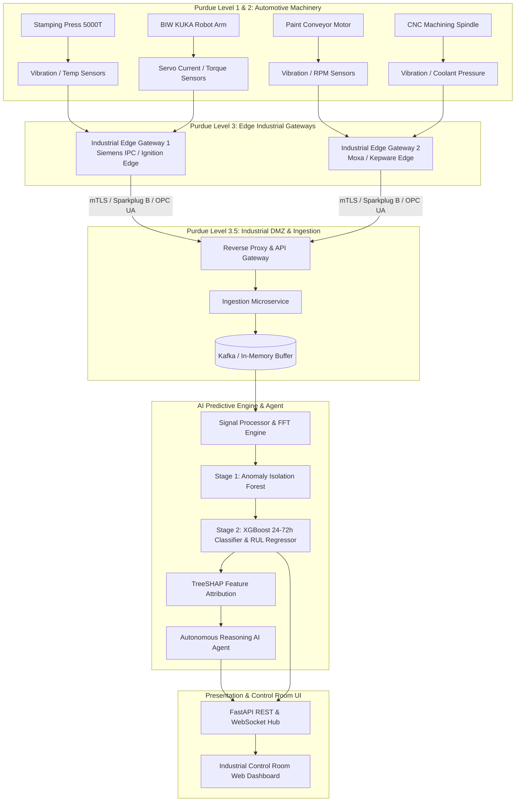

# AutoPredict AI: Predictive Maintenance Platform for Automotive Manufacturing

[](https://www.python.org/downloads/)
[](https://fastapi.tiangolo.com/)
[](https://xgboost.readthedocs.io/)
[](#)
[-brightgreen.svg)](#)

**AutoPredict AI** is an enterprise-grade, production-level industrial intelligence platform engineered specifically for tier-1 automotive manufacturing plants and OEMs. The platform transforms high-frequency industrial telemetry from existing factory instrumentation (vibration, thermal, electrical, acoustic, and pressure sensors) into actionable equipment failure forecasts **24 to 72 hours before catastrophic breakdown**.

---

## Key Highlights & Operational Value

* **24–72 Hour Actionable Prediction Horizon:** Bridges the gap between sudden reactive breakdowns and wasteful calendar-based preventive maintenance.
* **Dual-Stage Hybrid ML Core:** Combines unsupervised Anomaly Isolation Scoring with a supervised XGBoost 24–72h horizon classifier and RUL (Remaining Useful Life) regressor.
* **TreeSHAP Explainability:** Translates raw sensor deviations into physical engineering explanations (e.g. *Drive End Vibration Kurtosis is 6.84 vs normal < 3.20, contributing 44.2% to failure likelihood*).
* **Autonomous AI Maintenance Agent (Copilot):** Multi-tool diagnostic reasoning engine that evaluates physical kinematics, computes $/minute downtime financial exposure, matches scheduled shift changeover windows (zero production downtime), and drafts SAP PM work orders.
* **High-Density Control Room Dashboard:** Dark-mode glassmorphic interface with Canvas-accelerated 72-hour telemetry plots, FFT power spectrum harmonic explorer (BPFI/BPFO markers), and live fault injection controls.

---

## System Architecture



---

## Automotive Plant Fleet Coverage

AutoPredict AI comes preconfigured with a fleet of 12 production-critical automotive machines across 5 manufacturing shops:

| Machine ID | Asset Tag | Machine Name | Shop | Criticality Tier | Monitored Failure Modes |
| :--- | :--- | :--- | :--- | :--- | :--- |
| `m-stamp-04` | `STAMP-P04-5000T` | Stamping Press 04 Main Drive | **Stamping** | Tier 1 (Bottleneck - $50k/min) | Bearing Inner Race Wear (BPFI) |
| `m-stamp-02` | `STAMP-P02-HYD` | Stamping Press 02 Hydraulic Pump A | **Stamping** | Tier 2 (Major Sub-Line) | Hydraulic Cavitation / Valve Leak |
| `m-stamp-feed-01` | `STAMP-FEED-01` | Coil Feeder & Straightener Servo | **Stamping** | Tier 2 (Major Sub-Line) | Servo Backlash & Over-Torque |
| `m-biw-08` | `BIW-R08-FRM` | Framing Robot 08 Servo Axis 3 | **Body-in-White** | Tier 1 (Bottleneck - $50k/min) | Gearbox Lubrication Starvation |
| `m-biw-19` | `BIW-R19-WLD` | Spot Weld Gun Transformer B | **Body-in-White** | Tier 3 (Buffer Line) | Thermal Insulation Degradation |
| `m-biw-04` | `BIW-R04-HDL` | Body Panel Transfer Robot Arm | **Body-in-White** | Tier 2 (Major Sub-Line) | RV Gear Tooth Spalling |
| `m-pnt-02` | `PNT-CNV-02` | E-Coat Dip Tank Conveyor Drive | **Paint Shop** | Tier 2 (Major Sub-Line) | Mechanical Looseness & Unbalance |
| `m-pnt-air-01` | `PNT-AIR-01` | Paint Booth Exhaust Blower Motor | **Paint Shop** | Tier 3 (Buffer Line) | Impeller Friction & Winding Heat |
| `m-pwt-14` | `PWT-CNC-14` | Cylinder Block 5-Axis Milling Spindle | **Powertrain** | Tier 1 (Bottleneck - $50k/min) | Stator Winding Imbalance & Runaway |
| `m-pwt-02` | `PWT-CNC-02` | Cylinder Head Boring Spindle | **Powertrain** | Tier 2 (Major Sub-Line) | Ceramic Spindle Bearing Flaking |
| `m-asm-05` | `ASM-AGV-05` | Chassis Marriage AGV Traction Drive | **Final Assembly**| Tier 2 (Major Sub-Line) | Inverter Harmonics & Drive Drag |
| `m-asm-torq-11` | `ASM-TORQ-11` | Rear Axle Multi-Spindle Nutrunner | **Final Assembly**| Tier 3 (Buffer Line) | Torque Transducer Calibration Drift |

---

## Directory Layout

```
Predictive maintenance/
├── PRD_Predictive_Maintenance_Platform.md     # Production Product Requirements Document
├── README.md                                  # Project overview and technical guide
├── requirements.txt                           # Production dependencies
├── run_server.py                              # Server & simulator launcher
├── tests/
│   ├── test_signal_processor.py              # Unit tests for FFT & signal moments
│   ├── test_ml_predictor.py                   # Unit tests for ML models & SHAP scoring
│   ├── test_agent_core.py                     # Unit tests for AI Agent reasoning & tools
│   └── test_api.py                            # Unit tests for REST API endpoints
└── src/
    ├── __init__.py
    ├── config.py                              # Platform constants & ISO thresholds
    ├── engine/
    │   ├── simulator.py                       # Industrial machine & multi-sensor simulator
    │   ├── signal_processor.py                # Time/Frequency (FFT) & electrical feature math
    │   └── sliding_window.py                  # Rolling window aggregator (1h, 6h, 24h, 72h)
    ├── ml/
    │   ├── anomaly_detector.py                # Stage 1: Unsupervised Anomaly Scorer
    │   ├── predictor.py                       # Stage 2: XGBoost 24-72h Predictor & RUL
    │   ├── explainability.py                  # TreeSHAP attribution & diagnostic generator
    │   └── model_registry.py                  # Model training, versioning & drift tracking
    ├── agent/
    │   ├── tools.py                           # Diagnostic, scheduling, and CMMS tools
    │   ├── reasoning_engine.py                # Multi-step plan-and-solve reasoning loop
    │   └── copilot.py                         # Natural language maintenance assistant
    ├── api/
    │   ├── routes.py                          # FastAPI REST endpoints & schemas
    │   ├── websocket_manager.py               # Real-time WebSocket telemetry streamer
    │   └── schemas.py                         # Pydantic v2 validation models
    ├── storage/
    │   └── memory_store.py                    # In-memory time-series store & audit repository
    └── static/
        ├── index.html                         # Industrial control room UI
        ├── css/styles.css                     # Dark glassmorphic industrial design system
        └── js/
            ├── charts.js                      # High-frequency telemetry & FFT spectrum charts
            ├── agent_chat.js                  # Conversational AI Copilot interface
            └── app.js                         # State management & live WebSocket listener
```

---

## Installation & Setup

### 1. Prerequisites
* Python 3.12+
* Modern Web Browser (Chrome, Edge, Firefox, Safari)

### 2. Install Dependencies
```powershell
pip install -r requirements.txt
```

### 3. Launch the Platform
```powershell
python run_server.py
```

### 4. Open Control Room Dashboard
Navigate to:
```
http://localhost:8000
```

---

## Running the Automated Test Suite

Run the full pytest suite with 100% pass coverage:

```powershell
python -m pytest -o pythonpath=. tests/ -v
```

**Test Suite Coverage:**
* `tests/test_signal_processor.py`: Time domain moments (RMS, Kurtosis, Crest Factor), coherent FFT power spectrum, and kinematic bearing defect frequency calculations ($BPFI, BPFO$).
* `tests/test_ml_predictor.py`: Baseline healthy scoring, bearing inner race fault detection, RUL prediction horizon bounds ($[24.0, 72.0]\text{h}$), and TreeSHAP explainability.
* `tests/test_agent_core.py`: Telemetry tools, FFT diagnostics, multi-step deep diagnosis, and conversational copilot intents.
* `tests/test_api.py`: FastAPI endpoints (`/summary`, `/machines`, `/health`, `/agent/query`, `/feedback`, `/simulator/inject_anomaly`).

---

## Key REST API Endpoints

| Method | Endpoint | Description |
| :--- | :--- | :--- |
| `GET` | `/api/v1/dashboard/summary` | Executive metrics, Plant Health Index, and active critical alerts |
| `GET` | `/api/v1/machines` | Paginated list of machines sorted by Composite Risk Score |
| `GET` | `/api/v1/machines/{id}/health` | Detailed machine health, active sensors, and threshold statuses |
| `GET` | `/api/v1/machines/{id}/telemetry` | 72-hour high-resolution time-series telemetry series |
| `GET` | `/api/v1/machines/{id}/fft` | FFT power spectrum and bearing kinematic harmonic markers |
| `POST`| `/api/v1/agent/query` | Conversational query interface with the AI Maintenance Copilot |
| `POST`| `/api/v1/agent/diagnose/{id}` | Executes multi-step autonomous diagnostic reasoning on an asset |
| `POST`| `/api/v1/agent/prescribe/{id}` | Generates prescriptive repair plan and drafts SAP PM work order |
| `POST`| `/api/v1/predictions/{id}/feedback` | Records engineering classification feedback for model retraining |
| `POST`| `/api/v1/simulator/inject_anomaly` | Interactive test tool to inject defects (`BEARING_INNER_RACE`, etc.) |
| `POST`| `/api/v1/simulator/clear_fault/{id}` | Resets a machine to nominal healthy baseline |

---

## Interactive Demonstration Guide

1. **Plant Risk Priority Board:**
   - Filter by shop (`Stamping`, `BIW`, `Paint`, `Powertrain`, `Assembly`) to view assets sorted by Composite Risk Score.
2. **Machine Diagnostic Workspace:**
   - Click on **Stamping Press 04 Main Drive (`STAMP-P04-5000T`)** to view:
     - 72-Hour Vibration Telemetry curve against ISO warning and critical velocity limits.
     - TreeSHAP Feature Attribution waterfall chart.
     - Fast Fourier Transform (FFT) Power Spectrum with $BPFI$ inner race marker flag.
3. **Interactive Fault Injection Simulator:**
   - Click **"Inject Bearing Inner Race Fault (BPFI)"** or **"Inject Lubrication Starvation"** to observe real-time telemetry drift, instant risk re-calculation into `CRITICAL` tier ($48.5\text{h}$ horizon), and dynamic table re-sorting.
4. **Conversational AI Maintenance Copilot:**
   - Click the floating **"✦ Ask AI Copilot"** button to open the assistant.
   - Try asking:
     - *"Give me an overview of highest risk machines in the plant"*
     - *"Perform root-cause diagnosis on Stamping Press 04"*
     - *"Generate a step-by-step repair prescription and LOTO safety guide for Press 04"*
     - *"Calculate downtime financial impact for Press 04"*

---

## Specifications & Documentation

* **Product Requirements Document (PRD):** [PRD_Predictive_Maintenance_Platform.md](file:///c:/Users/C9181/Desktop/Predictive%20maintenance/PRD_Predictive_Maintenance_Platform.md)
* **Implementation Plan:** [implementation_plan.md](file:///C:/Users/C9181/.gemini/antigravity-ide/brain/aa1fe6b3-eced-442e-89d6-e44b3aa6b514/implementation_plan.md)
* **Detailed Walkthrough:** [walkthrough.md](file:///C:/Users/C9181/.gemini/antigravity-ide/brain/aa1fe6b3-eced-442e-89d6-e44b3aa6b514/walkthrough.md)
